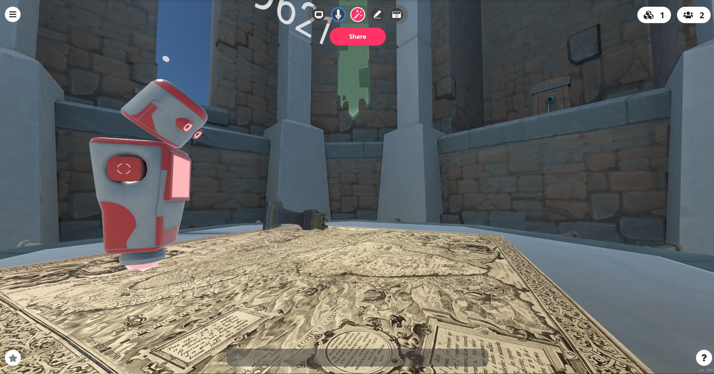
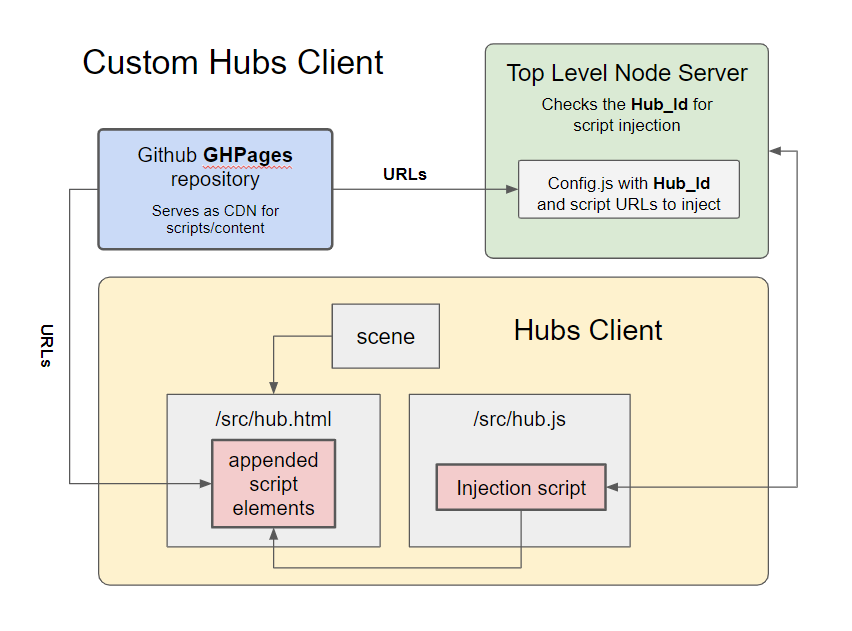
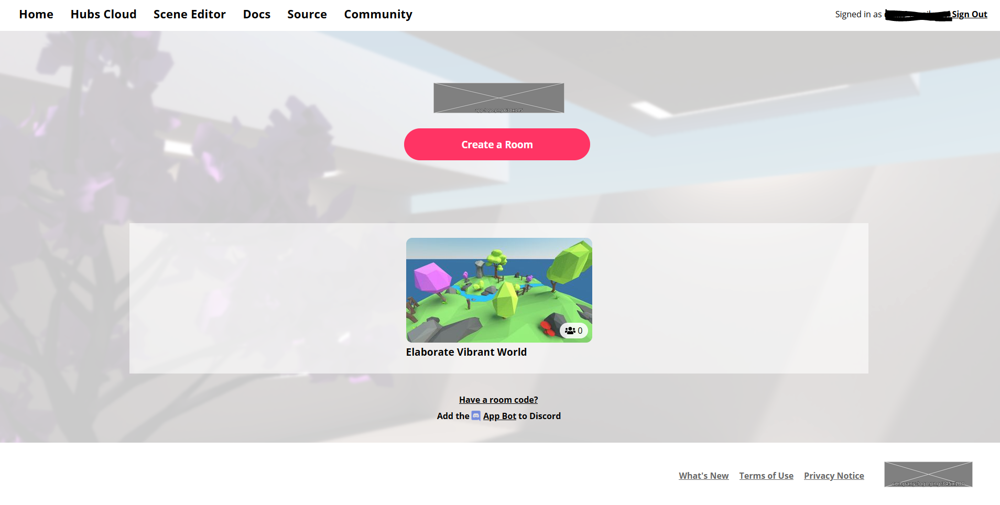
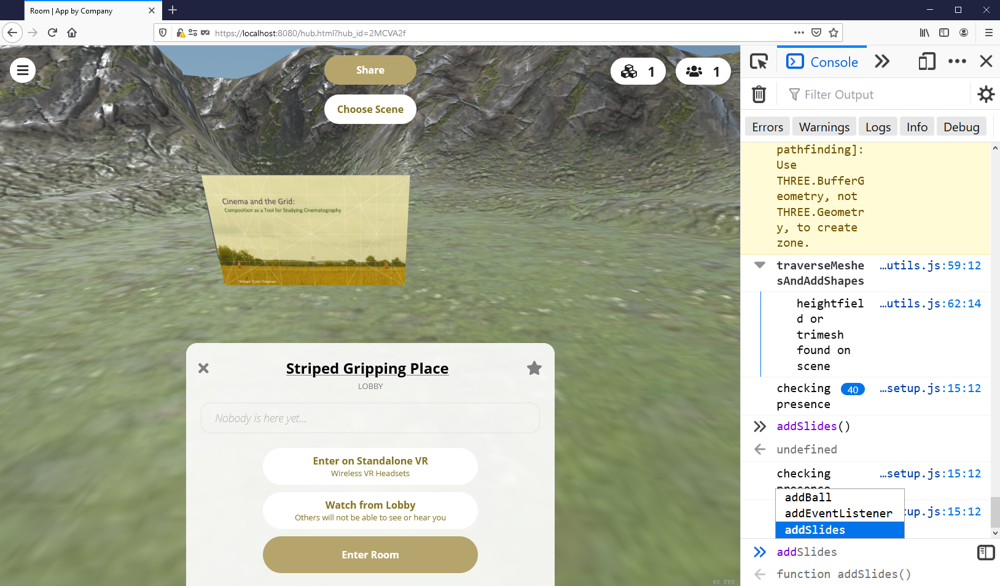
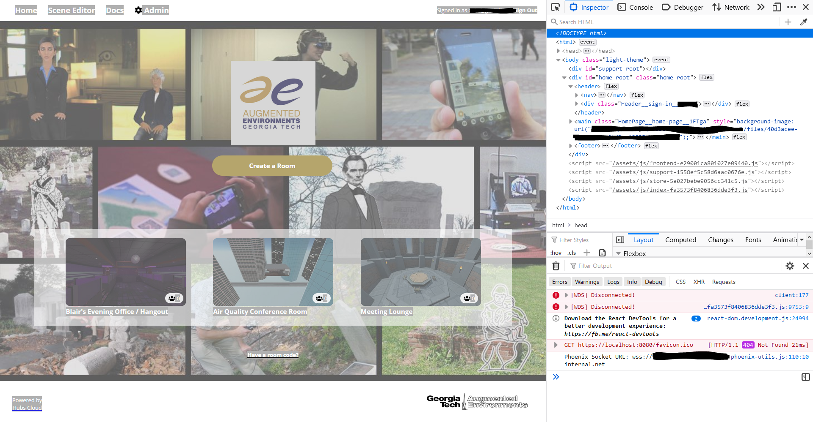
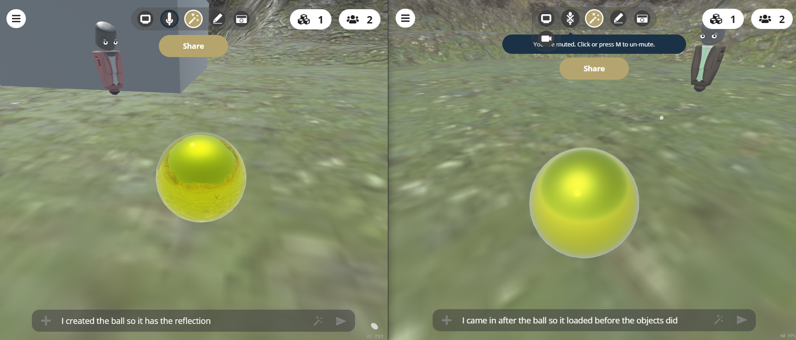
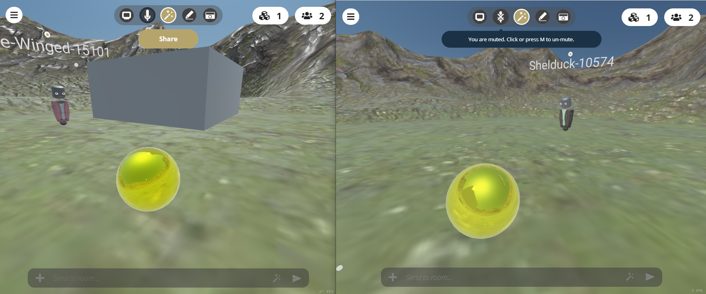
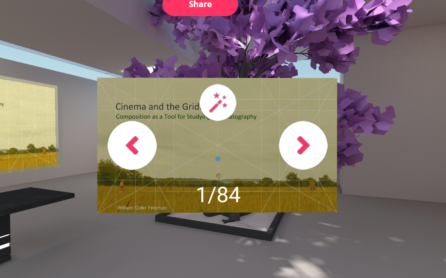

**Customizing Mozilla Hubs**

Here Be Dragons!	

# 

Documentation provided by:

Colin Freeman
wfreeman7@gatech.edu

Index

1. [Introduction	](#heading=h.arolcxe0i15c)					

    1. [Getting Started with WebXR](#heading=h.la5jp5tnimjw)	

2. [Creating a Custom Client for Hubs	](#heading=h.xmf7pl33m35m)		

    2. [Documentation for Hubs-Cloud](#heading=h.se1h93kdayjn)

    3. [Things to Consider	](#heading=h.wbv1nn9f16q5)			

    4. [Hubs Load Sequence](#heading=h.82cqacs6fmt)

        1. [Hubs.html](#heading=h.n02hpt7dad89)

        2. [Hijacking Hubs.js](#heading=h.6l79ldxsva9l)

3. [Creating Hubs Components](#heading=h.v5it9bezxc32)

    5. [Standard A-frame components](#heading=h.6benc8djio93)

    6. [Hubs Networked Components](#heading=h.ge62mjcpdcb9)

    7. [A-frame Component Lifecycle in Hubs](#heading=h.61rv9ktf181)

    8. [Cannibalizing Components from Hubs](#heading=h.1z9i2vkqnpfq)

4. [Adding New Scripts to a Custom Client](#heading=h.7lkqhku9luq8)

    9. [Hosting Scripts using GHpages on Github](#heading=h.ncdkbhi0qjw2)

# 1.  Introduction

Mozilla Hubs is a web based stack of applications which provide multiple interfaces to online webXR multi user meeting/presentation spaces.  To quote the documentation, "Hubs is a virtual collaboration platform that runs in your browser. With Hubs you can create your own 3D spaces with a single click. Invite others to join using a URL. No installation or app store required".

The ‘Stack’ of applications required to provide Hubs is large.  It includes Node.js, Three.js, Aframe.js, React, Reticulum as a backend content server and numerous other APIs.  Considering it’s complexity, it is a daunting task to ‘customize’ hubs in non-trivial ways that involve modifying the source code.  The documentation for this process at the time I’m writing this article is nearly non-existent.  So I’m creating documentation on the methods I’ve used to create a custom client for Mozilla hubs, including explanations for how to create your own custom Hubs components.  This documentation should not be considered complete or even sanctioned by Mozilla since many of the techniques I’m describing involve DOM manipulation in the browser using script injection after the client is loaded.  Since the client is hosted from the server that provides the content at the same URL the client is reached through, this may not seem like a "nefarious process".  However, hosting Hubs involves accessing interfaces on the User’s computer, including the microphone, the video camera, and even screen sharing the desktop. Pairing this type of client access with javascript code injection from outside repositories without providing the user some information about the process, should be considered ‘inconsiderate’ at best and ‘sneaky’ or ‘illegal’ at worst depending on what happens in the application.  So my recommendation is to proceed with a large amount of respect for the User of your application and use some caution in how you modify their ‘experience’ in Hubs.

## 1.1  Getting Started with WebXR

Where to start.  You can find a ‘technical’ description of Hubs at [ [System Overview · Hubs by Mozilla](https://hubs.mozilla.com/docs/system-overview.html) ]. It provides a high level description of what you are playing with in terms of modifying Hubs.  I suggest checking it out before you proceed with the rest of this article.  Once you’ve read that you will probably want to check out [ [Introduction to A-FRAME](https://aframe.io/docs/1.0.0/introduction/) ]in order to understand what Hubs wraps itself around.  I say wraps itself, because technically this is exactly what Hubs does.  It operates as a communication layer between several different browsers with the same Arame scene loaded into them.  Aframe is a WebXR entity component system that creates new DOM elements in standard HTML that leverage another more powerful API for WebGL called Three.js.  So in some ways Hubs is actually a wrapper of a wrapper around Three.js.  Once you learn something about Aframe, especially things like creating your own components, you will find yourself needing to know more about Three.js which you can learn here [ [Three.js Documentation](https://threejs.org/docs/index.html#manual/en/introduction/Creating-a-scene) ].  In the end it’s all javascript designed to make it easier to create WebGL applications.  As I mentioned above the amount of information you CAN learn is daunting, but if you know javascript already, in particular Node.js, then you may find you can do alot with a little.

The approach we are going to take in modifying Hubs is to attempt to ‘modify’ or ‘touch’ the Hubs source code as little as possible.  This accomplishes several key things, not least of which is to make it easier to keep up with Hubs changes as the developers modify and fix issues with it.  Here, finally is a graphic showing what our final application modifications should look like.

The Orange Hubs client part with the hub.html and hub.js are the only files we will actually modify in the Hubs stack.  Actually we really only put a small script into the hub.js file which will then modify the hub.html once it knows which scripts to inject.  The green ‘top level node server’ is a simple express server with one route which receives a query parameter for a ‘hub_id’ and replies with a string of URLs for Aframe components and Networked Aframe templates which can be stored on a CDN or in this case Github using the GHpages feature to serve as a CDN.  That’s it.  The code to do all of this is tricky, since you need to know where to ‘put’ things and how to determine when it’s Ok to put them there.  First I’ll share information on how to get the Mozilla Hubs custom client up and running and then I’ll go through the ‘load sequence’ Hubs uses to get everything synced up across the server.

# 2.  Creating a Custom Client for Hubs

## 2.1  Documentation for Hubs-Cloud

If you checked out the getting started link I posted above you may have noticed Mozilla gives you information on setting up a custom client at [Hubs-cloud-custom-clients](https://hubs.mozilla.com/docs/hubs-cloud-custom-clients.html) .  The information here is good and should get you going on setting up a custom client.  You may be asking what is a ‘Hubs custom client’ and why do I need one?   Good question!  The answer is that the ‘custom client’ is the web-page you will be directed to when you login into a Mozilla Hubs Cloud Installation.  Installing Hubs Cloud is beyond the scope of this article but there is documentation on that as well at [Mozilla Hubs Cloud docs](https://hubs.mozilla.com/docs/hubs-cloud-intro.html).  Suffice it to say that the Hubs Cloud is the "Server" you will need to run your own version of Hubs.  It is the “Backend” services that will serve the web pages you see when you open a ‘hub’ aka the ‘Client’.  The ‘Client’ is the page served on your machine hosted from the ‘Hubs Cloud’.  In order to customize the things that Hubs can do with Aframe or Three.js code you need to modify the source code for the client.  As mentioned in the first link in this section you can find the client source code on github in the [https://github.com/mozilla/hubs](https://github.com/mozilla/hubs) repo.  You’ll need to fork that to your own Github account so you can make modifications to the client and still merge with changes from the official mozilla hubs branch when they update it.  Follow the instructions on the [setup-your-fork-of-the-hubs-repo](https://hubs.mozilla.com/docs/hubs-cloud-custom-clients.html#setup-your-fork-of-the-hubs-repo) page.  

*Pay attention to the part that says *"git checkout hubs-cloud" .  *You want to make sure that is the branch you checkout and modify, since it is the one suited to working with your own cloud installation.  It will also allow you to run off of the Mozilla dev server with the right commands.*  Some issues you may have with getting the client setup correctly will probably have to do with your Node.js setup.  I suggest you use Node version manager (NVM) to create a clean Node.js installation in order to avoid dependency issues  with the client installation.  If you have never developed with Node.js on your machine you may not have any issues.  If you’ve done previous node projects, there is a good chance you’ll have some globally installed old versions of npm packages that will cause issues with trying to get the Hubs client installed and running.  NVM will solve these problems by creating a clean install of Node to work with the Hubs client.  Here is a nice tutorial on [installing node.js locally with NVM](https://heynode.com/tutorial/install-nodejs-locally-nvm).

Once you have Hubs forked and Node.js and NPM installed you can run the client install in a system console to install all of the Hubs dependencies.  The instructions for this can be found here [run-your-custom-client](https://hubs.mozilla.com/docs/hubs-cloud-custom-clients.html#run-your-custom-client).  Pay close attention to the directions.  You will want to run **_npm ci_** instead of **_npm install_** in order to make sure the dependencies installed are from the **package-lock.json**.  Then assuming you have your own Mozilla Hubs account or an admin account on your own Hubs cloud installation you can run **npm login** and get credentials installed to start running the client locally.  

## 2.2  Some things to Consider

One important thing to consider is whether you need to target specific hub’s scenes with your modifications.  If you run the hub’s client with **npm run dev** after logging into your **hubs.mozilla.com account** and authenticating with the email link you will only have access to the **mozilla dev server**.  Running the custom client in Dev mode will only load the default scene into Hubs with no access to other hub_ids or scenes.

This will allow you to play around with modifying the hub’s source and injecting things into the default scene, but if you need specific locations or target objects in a glb file to link to, it won’t be very useful.  In order to have access to other scenes that you create in Spoke or Blender you will need to connect to your own cloud instance, assuming you have one hosted on AWS or DigitalOcean.  If you do have your own Hubs cloud setup, you can do the same authentication with **hubs.<yourhubscloud>.com** server and **admin id**.  Then run **npm start **and direct your browser to **https://localhost:8080** to have access to your personal cloud server.  Once you’ve pointed your custom client to your own hubs cloud you’ll have access to any hub_id created on that cloud.  The image below shows a private hubs cloud server with functions I’ve injected using the custom client.

## 2.3  Hubs Load Sequence

When the Hubs client is called several things happen depending on where you are in the load sequence.  By load sequence I mean the order of pages loaded before you get into an actual "hub" or “room”.  To clarify, a hub is really a wrapper that encapsulates an A-frame scene and some objects or components loaded into that scene.  So when your client loads the **“Home”** screen that is the beginning of what I’m calling the “load” sequence.  From this screen, all that has really loaded is an html file with a sign-in link and some buttons to load the **hub.html** with specific **hub_ids**.

If you click on "Create a Room" or one of the room links it will load the file **hub.html** and **hub.js **with either the default hub_id or whichever hub_id you chose by clicking on one of the images.  The result is a loaded hub with the lobby screen waiting for you to click enter room.  This is the place where most modifications you might make to the custom client can go.  We will take a look at the code for each one of these files which can be found in the **“hubs/src”** folder of your hubs-cloud github repo.

## 2.3.1  Hubs.html

The **[hubs.html fil**e](https://github.com/mozilla/hubs/blob/hubs-cloud/src/hub.html) is a placeholder or template for the structure a hub is expected to have.
The code block below shows the skeletal structure of the hub.html.  The actual source file has many more elements in it.  The main points to know about it’s structure are that it contains an **<a-scene>** with many components attached that control how Hubs render the scene.  Within the a-scene is an **<a-assets>** element which contains any assets needed at load time for the scene.  These include **<template>** tags which are element groups used by Networked A-frame to create a-frame entities that are networked across clients.

<table>
  <tr>
    <td><!DOCTYPE html>  <!-- the code below is meant to illustrate the structure for hub.html, not its actual content.  There are many missing elements compared to the actual source file -->
<html>
   <head>...</head>
   <body>
      

      <!-- A-frame scene, templates, entities and components-->
      <a-scene
           component1="attribute: value"
           component2="attribute1: value; attribute2: value">
           <a-assets>
               
               
               <a-asset-item id="obj" src="./obj.glb"></a-asset-item>
               <a-asset-item id="obj1" src="./obj1.glb"></a-asset-item>
               <!-- templates are entities used to create networked elements-->

               <template id="template_id">
                    <!-- the structure of templates is built out of a-entity
                    with components, classes and tags ( which is a component )-->
                    <a-entity component></a-entity>
               </template>
               <template id="template_id1">
                    <a-entity component class="class" tags="sometag: true">
                    </a-entity>
               </template>
               <a-mixin id="mixin_id" some_component="attribute1: value1">
               </a-mixin>
           </a-assets>
           <!--the rest of the scene contains objects that should be in every
           Hub like avatars and media counters -->
           <a-entity id="hack-entity" visible="false"></a-entity>
           <a-entity id="id_1" component="attribute: value;"></a-entity>
           <a-entity id="id_2" component="attribute: value;"></a-entity>
   
           <a-entity id="scene-preview-node">
           </a-entity>
      </a-scene>
      <!--after the scene object there will be some divs for injecting html
      React elements as an interface on top of the 3D scene -->
      


   </body>
</html></td>
  </tr>
</table>

If you wanted to hard code changes into the custom client you would need to add any new **<template>** elements you need to network your new functionality here.  These templates would need to include the a-frame element structure of the new interactable objects with any new a-frame components attached to them.  Placing new templates in the hub.html file directly requires the editing and creation of several other files.  You will need to register your new template in **[hubs/src/network-schemas.j**s](https://github.com/mozilla/hubs/blob/hubs-cloud/src/network-schemas.js)** **using the  NAF.schemas.add() function.  On top of that, you will need to import any new a-frame components in the **[hubs/src/hub.j**s](https://github.com/mozilla/hubs/blob/hubs-cloud/src/hub.js) file.  For each new networked feature in your custom client you will need to edit at least two files and create one.  This makes keeping the Hubs client updated with fixes from Mozilla difficult.  However, there is a better way.  We can modify the just the **hub.js** file with a few functions that will inject any scripts we need from an external CDN.

## 2.3.2  Hijacking Hubs.js

The **[hubs.j**s](https://github.com/mozilla/hubs/blob/hubs-cloud/src/hub.js) file is where most of the code that deals with hubs gets loaded.  Each time you create a room or join a room on hubs a sequence of functions containing javascript promises runs to load the hub.  An example of hubs.js in pseudo code is shown below.  In actuality there are many more lines of code in hubs.js, but the pseudo code shows the load sequence in a way that is easier to understand. First we import all of your dependencies including aframe, components, react and utility functions.  Then we create the **APP **and it’s functions.  We will create a **"DOMContentLoaded" event listener** on the document where we join the channels for the Reticulum server once things are connected.  At the end of the event listener we call **handleHubChannelJoined(). ** After some initial setup code in handleHubChannelJoined() toward the end of the function,  is an async promise called **connectToScene()**.  After this code executes is where we want to inject any custom code so that it networks properly syncs across clients.

<table>
  <tr>
    <td>import "hacks/configs/themes/and/polyfills";
import "aframe";
import "more/hubs/specific/stuff";
import "aframe-components";
import "React-Packages";
import { App } from "./App";

function handleHubChannelJoined(entryManager, hubChannel, messageDispatch, data) {
  // at the bottom of handleHubChannelJoined is the connectToScene promise.  It will wait for channel specific data and kick off loading the scene hosted on the server.  We can inject code once the scene is loaded.
  const connectToScene = async () => {

    //add component to network the scene with NAF
    scene.setAttribute("networked-scene", { });

    //wait till things are networked correctly, code following the while command will not execute until the scene is networked
    while (!scene.components["networked-scene"] || !scene.components["networked-scene"].data) await nextTick();

    scene.addEventListener("adapter-ready", ({ detail: adapter }) => {
	//run code once the scene is networked
    });
    //store the hub in the APP.hub
    window.APP.hub = hub;
    updateUIForHub(hub, hubChannel);

    if (!isEmbed) {
      //loadEnvironmentAndConnect();
    } else {
      //run code then loadEnvironmentAndConnect();
    }

    // ** INJECTION OF SCRIPTS GOES HERE **
  };
  
  //call the connectToScene function once the hubChannel is joined
  connectToScene();
}

document.addEventListener("DOMContentLoaded", async () => {  
  //once the channels are setup run the functions to kick of loading scene elements
  handleHubChannelJoined(entryManager, hubChannel, messageDispatch, data);
});</td>
  </tr>
</table>

You can add a bunch of custom component links and network schemas into **hub.js** at the end of **connectToScene()** but that would mean every hub would have the same modifications which is not very efficient.  It is better to inject a "hook" that takes the current **APP.hub.hub_id** and sends a query for code to inject to a simple server which returns links or strings of code that the “hook” can inject into **hub.html**.  The advantages of this approach are numerous.  They are...

* We only modify the hubs source code in one file

* We can modify different hubs with different code

* We can change our modifications without touching hubs

* We can add additional functionality like sockets for data streams to our top level server

* Modifying hubs with new code can be done through a simple config file on our top level sever

The code to pull this off consists of a the following modification to the hub.js file

<table>
  <tr>
    <td>  const loadEnvironmentAndConnect = () => {

    // at the bottom of loadEnvironmentAndConnect we call the                    //
    // injectScripts function added after the if statement below                 //
    injectScripts();                                                             //
  } 

  window.APP.hub = hub;
  updateUIForHub(hub, hubChannel);
  scene.emit("hub_updated", { hub });
	
  // loadEnvironmentAndConnect needs to run before injectScripts() or the components will not network
  if (!isEmbed) {
      loadEnvironmentAndConnect();
  } else {
      remountUI({
         onPreloadLoadClicked: () => {
             hubChannel.allowNAFTraffic(true);
		remountUI({ showPreload: false });
		loadEnvironmentAndConnect();
	   }
      });
  }

  function injectScripts(){                                                      //
    //get the current hub_id and construct a url                                 //
    const myHub = hub.hub_id;                                                    //
    const url = "http://localhost:3000/injectScripts?hubid="+ myHub;             //
                                                                                 //
  //fetch the url with a get method which will return scripts to inject          //
    fetch(url, {                                                                 //
        method: 'get'                                                            //
    })                                                                           //    
    .then(function(body){                                                        //        
        return body.text();                                                      //
    }).then(function(data) {                                                     //
        var myUrls = data.split(",");                                            //
        var myBody = document.querySelector("body");                             //
        for(var items of myUrls) {                                               //
             if(items == "noUrls"){                                              //
                 Break;                                                          //
             }                                                                   //
             //inject some scripts based on the returned array of urls           //
             var newScript = document.createElement("script");                   //
             newScript.type = 'text/javascript';                                 //
             var srcAt = document.createAttribute('src');                        //
             srcAt.value = items;                                                //
             newScript.setAttributeNode(srcAt);                                  //
             myBody.appendChild(newScript);                                      //
       }                                                                         //
    });                                                                          //
  }                                                                              //
};
  connectToScene();
}</td>
  </tr>
</table>

The code consists of a single function that gets the current hub_id and uses a fetch() command to query our top level server for a string of comma delimited urls.  The top level server code is a simple  Express app with one route.

<table>
  <tr>
    <td>const http = require("http");
const https = require("https");
const express = require("express");
const cors = require('cors');
//load the config files which contains our hub_ids and their urls                //
const config = require('./config');                                              //
const app = express();
app.use(cors());
app.get(                                                                         //
       "/injectScripts",                                                         //
       async (req, res) => {                                                     //
                    let result = {}                                              //
                    Try{ result.success = true;}                                 //
                    catch(e){ result.success = false;}                           //
                    finally{                                                     //
                          var myHub = req.query.hubid;                           //
                          var myUrls = "";                                       //
                          for (var hubObj of config.hubsarray){                  //
                                 if(hubObj.hub_id == myHub){                     //
                                       myUrls = hubObj.urls;                     //
                                       res.send(myUrls);                         //
                                       break;                                    //
                                 }                                               //
                          }                                                      //
                          if(myUrls == ""){                                      //
                                res.send("noUrls");                              //
                          }                                                      //
                   }                                                             //
       });                                                                       //

var httpServer = http.createServer(app);

httpServer.listen(3000, () => 
   console.log("HTTP Server running on port 3000")
);</td>
  </tr>
</table>

The config file should be a module that looks something like the following

<table>
  <tr>
    <td>var config = {};

config.hubsarray = [
	{hub_id: '2MCVA2f', urls:'https://user.github.io/githubrepo/components/component1.js,https://user.github.io/githubrepo/components/component2.js,https://user.github.io/githubrepo2/components/component3.js,https://user.github.io/githubrepo3/components/component5.js,https://user.github.io/githubrepo4/components/component6.js,https://user2.github.io/githubrepo5/components/script1.js'},
	{hub_id: '8T88rLN', urls:'https://user2.github.io/githubrepo5/components/component1.js,https://user2.github.io/githubrepo5/components/component2.js'},
	{hub_id: 'kBquF8A', urls:'https://user1.github.io/githubrepo3/components/component1.js,https://user2.github.io/githubrepo5/components/component2.js'}
];

module.exports = config;</td>
  </tr>
</table>

This file consists of the variable config which has an attribute called hubsarray consisting of an array of JSON objects each with a hub_id and urls attribute.  The urls should point to a cdn which hosts your custom javascript.  In this case they point to ghpages hosted files on github.  You can explore setting up github repos as cdns at [pages.github.com](https://pages.github.com/).

To test your client locally run the top level server from a system console by shifting into the directory where your toplevelserver.js and config.js files are located.  Then run **node toplevelserver.js **and open a browser.  If you try to hit **[http://localhost:3000/injectScripts?hubid=someserveri**d](http://localhost:3000/injectScripts?hubid=someserverid)** **you should see the text "noUrls" show up in your browser window.  This is because “someserverid” was probably not a hubid that you put in your config file.  If you try the same url with ?hubid=<some hubid in your config> then you will get the urls string returned.  If we run this with our custom client hub.js then it should inject those urls into the hub.html as scripts and depending how those scripts are coded we should be able to add custom functions to hubs.

You can do a lot of other neat things with this top level server if you want to.  It could serve live streams of data from sensors or packages of data for specific types of 3d effects or 3d buffer objects.  Anything that can be passed into Three.js can be served to hubs from this top level server.  You have to create some code to handle these data streams but now that you have a custom client for getting data or code injected into hubs you can play around with making custom components to handle the new inputs.

# 3  Creating Hubs Components:

## 3.1  Standard A-frame components

Creating custom components for hubs can be done in several ways depending on how you want the components to interface between multiple clients.  If, for example, all you want is a custom material that will be placed on objects, a simple A-frame component will work.  However, if you want to be able to add objects with the new material after the hub loads then you need to consider how the objects should be networked between clients.  When a person enters a room in hubs compared to when the room was first created will affect what they see in the room if content was added to the room after it loaded.  The image below shows an example of a custom a-frame object added after a scene has loaded in two clients which enter the hub at different times.  One was the user that created the object the other came in after the object was created.  The component uses a three.js cube camera to capture the environment reflection and apply it to the ball.

The reflection map for both balls is calculated on each client because it does not need to be networked.  The ball on the left was added after all the objects loaded so it gets all of the objects loaded in the scene in its reflection.  The ball on the right was loaded as the user entered the hub because it had already been created in the other client and parts of it are networked, meaning it shares attributes across clients.  It’s reflection map only has the sky because the ground and other objects had not finished loading yet.

You can target the init/update of components for a-frame in several ways.  **Usually**, you can just add an eventlistener to the object’s element and listen for the "model-loaded" event like so the code snippet below.

<table>
  <tr>
    <td>init: function(){
		
		var obj = this.el.getObject3D('mesh');
		console.log(obj);
		// obj returns null here because the mesh has not loaded at init		
             this.loaded = this.el.addEventListener('model-loaded', () => {      //
			
			obj = this.el.getObject3D('mesh');
			console.log(obj);
			// returns the object mesh here because the mesh has loaded
		});
	  },</td>
  </tr>
</table>

The problem here is that the <a-scene> in hubs is actually a modified gltf object file that has been packaged in Spoke when the scene was created.  This means that it loads like any other object and may take some time to load.  It also means that the simple ball probably loads first since it’s much less complex and does not have a bunch of embedded components for hub’s functionality.  To fix the init for hubs you can target the object’s sceneEl for it’s ‘model-loaded’ event. 

<table>
  <tr>
    <td>this.loaded = this.el.sceneEl.addEventListener('model-loaded', () => {</td>
  </tr>
</table>

With that modification when another user enters the hub after the ball is created the reflection map will update when the scene model loads.

This gets a-frame rendering synced up between clients , but what about components that need to have interaction synced up.  That requires networking the component using networked a-frame (NAF) and may require a custom template to be added to the NAF.schemas object.  To illustrate the details we will create a slideshow component which can be advanced or rewound by any user.

## 3.2  Hubs Networked Components

We want to create a new type of presentation object for Hubs that takes a list of images hosted online and pulls them into Hubs as a presentation that we can step forward and backward through.  Now assume we want any user to be able to step through them like a ‘kiosk’ interface.  This means…

* We need to create a component which takes those images and displays them in A-frame.

* The component needs some way of keeping track which image it’s on. This needs to be shared across clients.

* We need to pass the current image to all of the other clients as the client loads which means you can login to the room late and still know there is a new slide show and it is on x slide.

* We may not want the slideshow present in the room at the start.  We may want to make it load later, which means we need to add an interface for instantiating the slideshow.

* We probably don’t want other people figuring out how to load the slideshow a second time after it’s already created so we put a limit on how many slideshows the room can have.

* Speaking of rooms we only want to load the slideshow in places that need it so we need a way to limit which hub it can load into.

* If there are already hubs interfaces that solve some of these things and add functionality for our slideshow we probably want to leverage those or modify them in some way that works for us.

Using our custom client we can accomplish this list of tasks with three ‘smallish’ scripts.  One script is specific to the slideshow [[ link hubs-slide-show.js on github](https://raw.githubusercontent.com/colinfizgig/Custom-Hubs-Components/main/components/hubs-slide-show.js) ] another script that allows us to modify the slides loaded for the presentation [ [link to slideconfig.js on github](https://raw.githubusercontent.com/colinfizgig/Custom-Hubs-Components/main/components/slideconfig.js) ] and finally a third script that lets us bind the function **addSlides()** to a chat command *‘addSlides*’ [ [link to presence-customcmd-setup.js on github](https://raw.githubusercontent.com/colinfizgig/Custom-Hubs-Components/main/components/presence-customcmd-setup.js) ].  This final script gets the job done but introduces the potential for problems which we will discuss later.  I’ll go over what these scripts do after a little description of how all of this works in Hubs.

## 3.3  A-frame component lifecycle in Hubs

As we discussed in the previous sections, how and when code gets initialized in Hubs affects the way the client executes that code and what the user experiences.  Said another way, when you initialize a component or load it in the lifecycle of the hub/room affects its behavior.  On top of that, how the component itself is coded to share functions across clients may affect the user experience differently in each client.

An A-frame component, by default, has several ‘lifecycle’ functions.  They are **init**, **tick**, **update**, **play**, **pause**, and **remove**.  Init is the first sequence and potentially the most complex depending on what the component does.  A standard a-frame component runs init when the component’s parent entity loads.  Usually this occurs when the a-scene is loaded but as we saw in the section above loading the scene does not mean every object in the scene is ready or loaded.  Media (images, movies, objects, gltf files) can load asynchronously to other elements in the scene.  In the case of Hubs the scene is actually composed of several components embedded in a gltf model with geometry, materials, textures, lights and cameras.  This scene model gets unpacked as an <a-scene> with many <a-entity>’s when it is loaded into a Hub.  Because we start a hub with a pre-existing hub.html file as a bootstrap for loading other elements relying on an initializing event related to a-scene is unreliable in Hubs.  The scene may exist already and then be re-loaded with new content based on some component attached to it or one imported in hub.js.  The example of the reflection ball above illustrates the point, but it only scratches the surface as far as coordinating elements between clients.

If all we used in Hubs were standard a-frame components there would be no way to share interaction across clients.  When a component needs to communicate with another client we need to include some NAF (networked aframe) initialization code in the components init file which sets it up to be networked.  For our slide presentation component the init with its NAF setup looks like the following.

<table>
  <tr>
    <td>init() {
    this.onNext = this.onNext.bind(this);
    this.update = this.update.bind(this);
    this.setupSlides = this.setupSlides.bind(this);

    //get our content from the variable in the script injected above.
    this.content = slideconfig.slides;
    this.max = this.content.length;
    NAF.utils                                                                    //
        .getNetworkedEntity(this.el)                                             //
        .then(networkedEl => {                                                   //
        this.networkedEl = networkedEl;                                          //
        this.networkedEl.addEventListener("pinned", this.update);                //
        this.networkedEl.addEventListener("unpinned", this.update);              //
        window.APP.hubChannel.addEventListener("permissions_updated", this.update);
        this.networkedEl.object3D.scale.setScalar(this.data.slideScale);         //
        this.currentSlide = this.networkedEl.getAttribute("slide-element").index; //
        this.setupSlides();                                                      //
    })                                                                           //
    .catch(() => {}); //ignore exception, entity might not be networked          //
},</td>
  </tr>
</table>

This extra code in the init sets up the functionality that will be "shared" across the network it creates a networkedEl out of the entity the component is applied to and creates even listeners that will call the update function when the component is pinned, unpinned or when the permissions in the hubChannel are updated.  On top of that it sets the media scale and most importantly the currentSlide to the component’s index attribute.  Then once the networking is accomplished, it runs setupSlides() which creates the slideshow.

<table>
  <tr>
    <td>setupSlides(){
    this.currentSlide = this.networkedEl.getAttribute("slide-element").index;
    this.el.setAttribute("media-loader", {src: this.content[this.currentSlide],  // fitToBox: true, resolve: false});                                                //
}</td>
  </tr>
</table>

The important thing to notice here is the use of the "media-loader" component.  This is a hubs component that already takes care of loading new media into hubs, whether it’s images, video, pdfs or gltfs.  This means that with a little customization of the media-loader component you could create a slideshow that can contain all of these media elements.  The main issue with using the media-loader in its default form is that it injects menu structures on top of each different media type which may not work for our presentation menu.  By leveraging this component in our custom component we can leverage its functionality without having to create redundant functions to load our images for the presentation.

The final function to get the slideshow to work is the async update().  Update was linked to eventListeners on the networkedEl and hubChannel in the NAF setup in Init.  When a user pins, unpins or takes ownership of the object Update will run.  In hubs the act of clicking on an object can take ownership of the object so this means when the object is clicked the update will run. 

<table>
  <tr>
    <td>async update(oldData) {
    //set the currentSlide to the current data index
    this.currentSlide = this.data.index;

    //set the media-loader to the currentSlide one more or one less	
    this.el.setAttribute("media-loader", {src: this.content[this.currentSlide], fitToBox: true, resolve: false});
    
    //if the entity is networked and owned by the user who clicked it then...
    if (this.networkedEl && NAF.utils.isMine(this.networkedEl)) {

        //if the index number if different then...
        if (oldData && typeof oldData.index === "number" && oldData.index !== this.data.index) {

            //set the component's index attribute to the new currentSlide number
            this.networkedEl.setAttribute("slide-element", {index: this.currentSlide});
        }
    }
},</td>
  </tr>
</table>

All this function does is get the current index number and set the media-loader content to that index.  Then it updates its own index to keep track of the current slide number.   You may notice at this point that there is not a function on this component which actually increases or decreases the index value.  Which means it can’t change slides at this point.  We could attach a function called onNext which would wait for interaction/click on the slide and increment the index in one direction, but it’s better to add an interface to the slideshow which can go forward and backward in the slides.  To do this we add another **["slidemenu-pager" componen**t](https://github.com/colinfizgig/Custom-Hubs-Components/blob/main/components/hubs-slide-show.js) which attaches to the slideshow and is controlled by a menu attached to the slideshow.

## 3.4  Cannibalizing Components from Hubs

One way to make it easier to code and to make the user interface more consistent is to cannibalize a pre-existing  functionality which does similar things to the functionality we need.  You can find all sorts of examples of functionality like this in the **[component**s](https://github.com/colinfizgig/hubs/tree/master/src/components)** **and templates that ship with hubs.  One good example is the **[media-loade**r](https://github.com/colinfizgig/hubs/blob/master/src/components/media-loader.js) component which has functionality and menus for 4 different types of media.  One of which is a pdf media type which has an arrow based paging function and an index of the current page as well.  There is some extra functionality in this menu which we don’t need like the copy image  button on the top.

We can copy this component functionality called **"media-pager"** which is built into the “media-loader” component and customize it for our slideshow.  We copy the component and take out the parts we don’t need and add functionality we want.  The parts that should be removed or changed are highlighted in red and the parts that replace them will be highlighted in green.

Our new **"slidemenu-pager" component** is edited like this.

<table>
  <tr>
    <td>AFRAME.registerComponent("media-pager", {                                                 //                   
// we need a new component name so we don't lose the pdf media-pager functionality
AFRAME.registerComponent("slidemenu-pager", {                                             //

schema: {index: { default: 0 }, maxIndex: { default: 0 } },

init() {
    this.onNext = this.onNext.bind(this);
    this.onPrev = this.onPrev.bind(this);
    this.onSnap = this.onSnap.bind(this);                                                 //        
    this.update = this.update.bind(this);
    this.content = slideconfig.slides;                                                    //
    this.data.maxIndex = this.content.length - 1;                                         //
    this.el.setAttribute("hover-menu__pager", { template: "#pager-hover-menu", isFlat: true }); 
// replace with
    this.el.setAttribute("hover-menu__pager", { template: "#slidepager-hover-menu", isFlat: true });                                                                                  //
    this.el.components["hover-menu__pager"].getHoverMenu().then(menu => {
        // If we got removed while waiting, do nothing.
        if (!this.el.parentNode) return;

        this.hoverMenu = menu;
        this.nextButton = this.el.querySelector(".next-button [text-button]");
        this.prevButton = this.el.querySelector(".prev-button [text-button]");
        this.snapButton = this.el.querySelector(".snap-button [text-button]");            //           
        this.pageLabel = this.el.querySelector(".page-label");
        this.nextButton.object3D.addEventListener("interact", this.onNext);
        this.prevButton.object3D.addEventListener("interact", this.onPrev);
        this.snapButton.object3D.addEventListener("interact", this.onSnap);               //           
        this.update();
        this.el.emit("pager-loaded");                                                     //                                                                  
    });
    NAF.utils
	.getNetworkedEntity(this.el)
	.then(networkedEl => {
            this.networkedEl = networkedEl;
            this.networkedEl.addEventListener("pinned", this.update);
            this.networkedEl.addEventListener("unpinned", this.update);
            window.APP.hubChannel.addEventListener("permissions_updated", this.update);

            // sync our data.index to the slide-element.index
            this.data.index = this.networkedEl.getAttribute("slide-element").index;        //
	})
	.catch(() => {}); //ignore exception, entity might not be networked
        this.el.addEventListener("pdf-loaded", async () => {                              //               
            this.update();                                                                //               
        });                                                                               //  
},

async update(oldData) {
    if (this.networkedEl && NAF.utils.isMine(this.networkedEl)) {
	if (oldData && typeof oldData.index === "number" && oldData.index !== this.data.index) {
	    this.el.emit("owned-pager-page-changed");
	}
    }
    if (this.pageLabel) {
        this.pageLabel.setAttribute("text", "value", `${this.data.index + 1}/${this.data.maxIndex + 1}`);
    }

    if (this.prevButton && this.nextButton) {
        const pinnableElement = this.el.components["media-loader"].data.linkedEl || this.el;
        const isPinned = pinnableElement.components.pinnable && pinnableElement.components.pinnable.data.pinned;
        this.prevButton.object3D.visible = this.nextButton.object3D.visible =
            !isPinned || window.APP.hubChannel.can("pin_objects");
    }
},

onNext() {
    if (this.networkedEl && !NAF.utils.isMine(this.networkedEl) && !NAF.utils.takeOwnership(this.networkedEl)) return;
    const newIndex = Math.min(this.data.index + 1, this.data.maxIndex);
    this.el.setAttribute("media-pdf", "index", newIndex);                                 //
    this.el.setAttribute("media-pager", "index", newIndex);                               //
    //becomes
    this.el.setAttribute("slide-element", "index", newIndex);                              //     
    this.el.setAttribute("slidemenu-pager", "index", newIndex);                           //
},

onPrev() {
    if (this.networkedEl && !NAF.utils.isMine(this.networkedEl) && !NAF.utils.takeOwnership(this.networkedEl)) return;
    const newIndex = Math.max(this.data.index - 1, 0);
    this.el.setAttribute("media-pdf", "index", newIndex);                                 //
    this.el.setAttribute("media-pager", "index", newIndex);                               //
    // becomes
    this.el.setAttribute("slide-element", "index", newIndex);                              //
    this.el.setAttribute("slidemenu-pager", "index", newIndex);                           //
},

onSnap() {                                                                                //
    this.el.emit("pager-snap-clicked");                                                   //
},                                                                                        //

remove() {
    if (this.networkedEl) {
        this.networkedEl.removeEventListener("pinned", this.update);
        this.networkedEl.removeEventListener("unpinned", this.update);
    }
    window.APP.hubChannel.removeEventListener("permissions_updated", this.update);
}
});</td>
  </tr>
</table>

One big difference for this component compared to its pdf counterpart is to set the maxIndex attribute to the number of slide images we have in our slideconfig file.

    **this**.content = slideconfig.slides;                                                    //
    **this**.data.maxIndex = **this**.content.length - 1;                                         //

The second big difference is to create a new object template that modifies the menu-pager menu to remove the "snap" button.

**this**.el.setAttribute("hover-menu__pager", { template: "#pager-hover-menu", isFlat: true }); 
Becomes this.


**this**.el.setAttribute("hover-menu__pager", { template: "#slidepager-hover-menu", isFlat: true });                                                                                       //

Of course the template #slidepager-hover-menu does not exist in standard hubs which means we need to create another piece of code that creates it.  At this point the way we construct the code changes from standard javascript, to DOM manipulation javascript which looks more verbose.  If we look at an example of javascript registering a template in **[network-schemas.j**s](https://github.com/colinfizgig/hubs/blob/master/src/network-schemas.js) we can see an example like the following code.

<table>
  <tr>
    <td>NAF.schemas.add({
    template: "#interactable-media",
    components: [
      {
        component: "position",
        requiresNetworkUpdate: vectorRequiresUpdate(0.001)
      },
      {
        component: "rotation",
        requiresNetworkUpdate: vectorRequiresUpdate(0.5)
      },
      {
        component: "scale",
        requiresNetworkUpdate: vectorRequiresUpdate(0.001)
      },
      "media-loader",
      {
        component: "media-video",
        property: "time"
      },
      {
        component: "media-video",
        property: "videoPaused"
      },
      {
        component: "media-pdf",
        property: "index"
      },
      "pinnable"
    ],
    nonAuthorizedComponents: [
      {
        component: "media-video",
        property: "time"
      },
      {
        component: "media-video",
        property: "videoPaused"
      },
      {
        component: "media-pager",
        property: "index"
      }
    ]
  });</td>
  </tr>
</table>

This code tells NAF which components and which properties should be shared with other clients.  You can see that **"media-pager"** is shared along with it’s **“index”**.  The same with **“media-pdf”**.  However, one important thing to know about NAF templates is that they need some DOM elements in the current HTML as a reference.  The **#Interactable-media template** can be found in the **[src/hub.htm**l](https://github.com/colinfizgig/hubs/blob/master/src/hub.html) file inside the <a-assets> tag.  It looks like this with white space removed for brevity and in 5pt type.  Don’t try to read it, I’m only showing it for illustration purposes.

<table>
  <tr>
    <td><template id="interactable-media"><a-entity HandCollisionTarget: true; isHoldable: true; offersHandConstraint: true; offersRemoteConstraint: true; inspectable: true;" destroy-at-extreme-distances scalable-when-grabbed floaty-object="modifyGravityOnRelease: true; autoLockOnLoad: true;" set-yxz-order matrix-auto-update hoverable-visuals position-at-border__freeze="target:.freeze-menu" position-at-border__freeze-unprivileged="target:.freeze-unprivileged-menu" listed-media use-audio-system-settings><a-entity class="ui interactable-ui"><a-entity class="freeze-menu" visibility-while-frozen="withinDistance: 100; withPermission: spawn_and_move_media"><a-entity mixin="rounded-text-action-button" is-remote-hover-target tags="singleActionButton:true" pin-networked-object-button="tipSelector:.pin-button-tip; labelSelector:.pin-button-label;" position="0 0.125 0.001"><a-entity class="pin-button-label" visible="false" text=" value:pin; width:1.75; align:center;" text-raycast-hack position="0 0 0.001"></a-entity></a-entity><a-entity class="pin-button-tip" text="value:Pinning will broadcast this object to Discord.; width:1.75; align:center; color:#fff;" visible="false" text-raycast-hack slice9=" color: #0F40A9; width: 1.8; height: 0.2; left: 64; top: 64; right: 66; bottom: 66; opacity: 1.0; src: #button" position="0 0.6 0.001"></a-entity><a-entity is-remote-hover-target tags="singleActionButton:true;" mixin="rounded-text-button" camera-focus-button="track: false" position="-0.25 0.375 0.001"><a-entity text=" value:focus; width:1.75; align:center;" text-raycast-hack position="0.075 0 0.02"></a-entity><a-entity sprite icon-button="image: camera-action.png; hoverImage: camera-action.png;" scale="0.165 0.165 0.165" position="-0.125 0.005 0.02" ></a-entity></a-entity><a-entity is-remote-hover-target tags="singleActionButton:true;" mixin="rounded-text-button" camera-focus-button="track: true" position="0.25 0.375 0.001"><a-entity text=" value:track; width:1.75; align:center;" text-raycast-hack position="0.075 0 0.02"></a-entity><a-entity sprite icon-button="image: camera-action.png; hoverImage: camera-action.png;" scale="0.165 0.165 0.165" position="-0.125 0.005 0.001"></a-entity></a-entity><a-entity mixin="rounded-button" is-remote-hover-target tags="singleActionButton: true;" hide-when-pinned-and-forbidden="whenPinned: true" remove-networked-object-button position="0 -0.375 0.001"> <a-entity sprite="name: remove-action.png" icon-button="image: remove-action.png; hoverImage: remove-action.png" scale="0.165 0.165 0.165" position="0 0 0.001"></a-entity></a-entity><a-entity visibility-on-content-types="contentTypes: video/ audio/ image/ application/vnd.apple.mpegurl application/x-mpegurl application/pdf; visible: false;"><a-entity mixin="rounded-button" is-remote-hover-target tags="singleActionButton: true;" drop-object-button hide-when-pinned-and-forbidden="whenPinned: true" position="0 -0.625 0.001"><a-entity sprite icon-button="image: drop-action.png; hoverImage: drop-action.png" scale="0.165 0.165 0.165" position="0 0 0.001"></a-entity></a-entity></a-entity><a-entity mixin="rounded-button" is-remote-hover-target tags="isHoldable: true; holdableButton: true;" inspect-button visibility-on-content-types="contentTypes: video/ audio/ image/ application/vnd.apple.mpegurl application/x-mpegurl application/pdf;" position="0 -0.625 0.001"><a-entity sprite icon-button="image: focus-action.png; hoverImage: focus-action.png" scale="0.165 0.165 0.165" position="0 0 0.001"></a-entity></a-entity><a-entity class="deserialize-drawing" visible="false" mixin="rounded-button" is-remote-hover-target tags="singleActionButton: true;" deserialize-drawing-button position="-0.3 -0.625 0.001"><a-entity sprite icon-button="image: deserialize-action.png; hoverImage: deserialize-action.png" scale="0.165 0.165 0.165" position="0 0 0.001"></a-entity></a-entity><a-entity is-remote-hover-target tags="singleActionButton:true;" mixin="rounded-text-button" open-media-button="onlyOpenLink: true" position="0.43 -0.375 0.001"><a-entity text="value:open link; width:1.75; align:center;" text-raycast-hack position="0 0 0.02"></a-entity></a-entity><a-entity mixin="rounded-text-button ui" is-remote-hover-target tags="singleActionButton: true; isHoverMenuChild: true;" local-refresh-media-button position="0.43 -0.6 0.001"><a-entity text="value:refresh; width:1.75; align:center;" text-raycast-hack position="0 0 0.02"></a-entity></a-entity><a-entity is-remote-hover-target tags="singleActionButton:true;" mixin="rounded-text-button" clone-media-button position="-0.43 -0.375 0.001"><a-entity text="value:clone; width:1.75; align:center;" text-raycast-hack position="0 0 0.02"></a-entity></a-entity><a-entity mixin="rounded-action-button" tags="isHoldable: true; holdableButton: true;" is-remote-hover-target transform-button transform-button-selector hide-when-pinned-and-forbidden position="-0.3 -0.125 0.001"><a-entity sprite icon-button="image: rotate-action.png; hoverImage: rotate-action.png;" scale="0.165 0.165 0.165" position="0 0 0.001"></a-entity></a-entity><a-entity mixin="rounded-action-button" is-remote-hover-target tags="singleActionButton:true;" mirror-media-button visibility-on-content-types="contentTypes: video/ audio/ image/ application/vnd.apple.mpegurl application/x-mpegurl application/pdf;" position="0 -0.125 0.001"><a-entity sprite icon-button="image: inspect-action.png; hoverImage: inspect-action.png" scale="0.165 0.165 0.165" position="0 0 0.001"></a-entity></a-entity><a-entity mixin="rounded-action-button" tags="isHoldable: true; holdableButton: true;" is-remote-hover-target scale-button hide-when-pinned-and-forbidden position="0.3 -0.125 0.001"><a-entity sprite icon-button="image: scale-action.png; hoverImage: scale-action.png" scale="0.165 0.165 0.165" position="0 0 0.001"></a-entity></a-entity></a-entity><a-entity class="freeze-unprivileged-menu" visibility-while-frozen="withinDistance: 100; withoutPermission: spawn_and_move_media;"><a-entity mixin="rounded-text-button ui" is-remote-hover-target tags="singleActionButton: true; isHoverMenuChild: true;" local-refresh-media-button position="0 -0.6 0.001"><a-entity text="value:refresh; width:1.75; align:center;" text-raycast-hack position="0 0 0.02"></a-entity></a-entity><a-entity is-remote-hover-target tags="singleActionButton:true;" mixin="rounded-text-button" open-media-button="onlyOpenLink: true" position="0 -0.25 0.001"><a-entity text="value:open link; width:1.75; align:center;" text-raycast-hack position="0 0 0.02"></a-entity></a-entity><a-entity mixin="rounded-action-button" is-remote-hover-target tags="singleActionButton:true;" mirror-media-button visibility-on-content-types="contentTypes: video/ audio/ image/ application/vnd.apple.mpegurl application/x-mpegurl application/pdf;" position="0 0 0.001"><a-entity sprite icon-button="image: inspect-action.png; hoverImage: inspect-action.png" scale="0.165 0.165 0.165" position="0 0 0.001"></a-entity></a-entity><a-entity mixin="rounded-button" tags="isHoldable: true; holdableButton: true;" is-remote-hover-target inspect-button position="0 0.25 0.001"><a-entity sprite icon-button="image: focus-action.png; hoverImage: focus-action.png" scale="0.165 0.165 0.165" position="0 0 0.001"></a-entity></a-entity></a-entity></a-entity></a-entity></template></td>
  </tr>
</table>

The point here is that it can take a lot of elements with components and attributes applied to make a template.  More importantly templates must exist in the HTML in order to be registered with NAF.  This means we need to create some javascript to inject something like the code above into the <a-assets> tag when our custom hub loads.  We wrap this code in a function and add it to the list of scripts we load in hub.js.  Here is a small part of our template code for the slideshow.  You can see the full code **[here**.](https://github.com/colinfizgig/Custom-Hubs-Components/blob/main/components/slideshow-template.js)

<table>
  <tr>
    <td>function inject_slideshow_template() {
    // create a variable that points to a-assets
    let assets = document.querySelector("a-assets");

    // create a new template element in the document
    let newTemplate = document.createElement("template");
    // set the template id to the name of the template
    newTemplate.id = "slideshow-media";

    // create a placeholder element which we can use to attach new elements to the template.
    let newEntity = document.createElement("a-entity");
    // set or create attributes on the newEntity.  the interactable class works with hubs interaction systems to enable interaction on the element
    newEntity.setAttribute("class", "interactable");
    // create a tempAtt variable to set the value for multiple attributes.  The 'body-helper' component is used to set physics attributes on interactable objects
    let tempAtt = document.createAttribute("body-helper");
    tempAtt.value = "type: static; mass: 1; collisionFilterGroup: 1; collisionFilterMask: 15;";
    // apply the values to the body-helper attribute created above
    newEntity.setAttributeNode(tempAtt);
    // create another attribute or component like 'owned-object-limiter'
    tempAtt = document.createAttribute("owned-object-limiter");
    // set the value of the components counter property to #mediacounter
    tempAtt.value = "counter: #media-counter";
    // apply the attribute values to the component
    newEntity.setAttributeNode(tempAtt);

    // do this for as many components as you need to apply to the templates main entity.  Don't forget to add your new components and their default properties to the template
    tempAtt = document.createAttribute("slide-element")
    tempAtt.value = "index:0"
    newEntity.setAttributeNode(tempAtt);
    tempAtt = document.createAttribute("slidemenu-pager")
    tempAtt.value = "index:0"
    newEntity.setAttributeNode(tempAtt);

    // we need to create some child elements on this template to hold the menus we need.
    let newChild = document.createElement("a-entity");
    // set the classes for the menus
    newChild.setAttribute("class", "ui interactable-ui");
    // another way to create complex element setups like menus is to set them up in html and turn them into strings which can be set to the menu entity's innerHTML value.  It's less readable but requires less coding
    newChild.innerHTML = "<a-entity class='freeze-menu' visibility-while-frozen='withinDistance: 100; withPermission: spawn_and_move_media'><a-entity mixin='rounded-text-action-button' is-remote-hover-target tags='singleActionButton:true' pin-networked-object-button='tipSelector:.pin-button-tip; labelSelector:.pin-button-label;' position='0 0.125 0.001'><a-entity class='pin-button-label' visible='false' text=' value:pin; width:1.75; align:center;' text-raycast-hack position='0 0 0.001'> </a-entity><!-- all of the menu entities would go inside this string --></a-entity>";
    // append the child menu with all of its elements to our new entity
    newEntity.appendChild(newChild);
    // append the newEntity and its children to our newTemplate
    newTemplate.content.appendChild(newEntity);
    // append our newTemplate to the <a-assets> tag in hub.html
    assets.appendChild(newTemplate);
};
NAF.schemas.add({
    template: "#slideshow-media",
        components: [
        {
            component: "position",
            requiresNetworkUpdate: vectorRequiresUpdate(0.001)
        },
        {
            component: "rotation",
            requiresNetworkUpdate: vectorRequiresUpdate(0.5)
        },
        {
            component: "scale",
            requiresNetworkUpdate: vectorRequiresUpdate(0.001)
        },
        "media-loader",
        {
            component: "slide-element",
            property: "index"
        },
        {
            component: "slidemenu-pager",
            property: "index"
        },
            "pinnable"
        ],
        nonAuthorizedComponents: []
    });
}

inject_slideshow_template();</td>
  </tr>
</table>

With the combination of the inject_slideshow_template() and inject_slideshow_Media() which add the **slidemenu-pager** component, **slide-element** component and the **#slideshow-media** template we can add a slide presentation to our hubs room with the following function.

<table>
  <tr>
    <td>// we add the prefix mod_ to this function to allow it to be targeted by the chat interface using https://github.com/colinfizgig/Custom-Hubs-Components/blob/ghpages/components/presence-customcmd-setup.js

function mod_addSlides(){
	//only perform this once if the slideshow does not exist already.
	if(document.querySelector("a-entity[slide-element]") == null){
		var el = document.createElement("a-entity")
		el.setAttribute("id", "slideshow")
		el.setAttribute("networked", { template: "#slideshow-media" } )
		el.setAttribute("media-loader", {animate: false, fileIsOwned: true})
		el.object3D.position.y = 2;
		AFRAME.scenes[0].appendChild(el)
	}else{
		console.log("a slideshow already exists");
	}
}</td>
  </tr>
</table>

# 4  Adding New Scripts to a Custom Client

When we call mod_addSlides() in our custom client now it will check to see if an entity with the slide-element component on it exists and if it does not it will create one using the #slideshow-media template.  To inject the scripts for this into our custom client we just need to add the following line to our config.hubsarray variable in the top-level-server **[config.j**s](https://github.com/colinfizgig/Custom-Hubs-Components/blob/ghpages/top-level-main-server/config.js) file.

<table>
  <tr>
    <td>{hub_id: '2MCVA2f', urls:'https://colinfizgig.github.io/Custom-Hubs-Components/components/slideconfig.js,https://colinfizgig.github.io/Custom-Hubs-Components/components/slideshow-template.js,https://colinfizgig.github.io/Custom-Hubs-Components/components/hubs-slide-show.js,https://colinfizgig.github.io/Custom-Hubs-Components/components/presence-customcmd-setup.js'}</td>
  </tr>
</table>

The hub_id is the hub capable of running these scripts in our custom client and the urls are links to our scripts hosted on github ghpages.  The final script is a function which binds all functions with the prefix "mod_" to the chat interface in hubs.  It links the function name minus the “mod_” to a command which can be entered in the chat to spawn our presentation.  By forcing the script to only target scripts with the mod_ prefix we limit the functions which can be executed with chat commands and avoid name collisions in the global namespace.

## 4.1  Hosting Scripts using GHpages on Github

Once you have scripts to inject into the client you need someplace to host them where they can be served to the client for injection.  We could host them from our top-level-server using another route in Express.  However, it is better and more efficient to add them to a Github repository and set that repo up to serve as a CDN using GHpages.  You can read how to set your repository up this way at **[https://pages.github.com**/](https://pages.github.com/)**.**

The advantages of hosting and storing your custom code this way are too numerous to mention.  The largest advantage though is that you won’t have to constantly update your top-level-server on your cloud setup.  In addition you can opensource your components and benefit from other developer’s help in keeping them maintained.  

